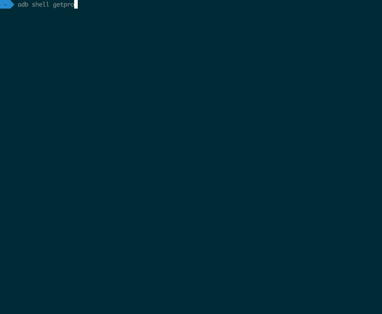

# Leoric

Leoric 是一个 Android 上的黑科技保活方法的 PoC，它可以对抗在任意 Android 版本上的 force-stop 杀进程。

> Leoric 是 Dota 中的英雄"骷髅王"，本项目名取自骷髅王的大招「重生」。



## 重现方法

虽然理论上这个方法可以支持任意的 Android 版本，但本 PoC 仅仅在 Android 9.0上测试过。具体使用方式参见 demo 项目。

## 应对方法

保证在执行 `force-stop` 的时候，不要让被 `force-stop` 的那个进程有任何机会启动新的进程即可；下面是一种简单的方法杀死 Leoric:

```
ps -A | grep `ps -A | grep me.weishu.leoric | awk '{print $1}' | head -1` | awk '{print $2}' | xargs kill -19 && am force-stop me.weishu.leoric
```

## 实现原理

- [Android 黑科技保活实现原理揭秘](http://weishu.me/2020/01/16/a-keep-alive-method-on-android/)
- [深度剖析App保活案例](http://gityuan.com/2018/02/24/process-keep-forever/)


## Contact me
Email: twsxtd@gmail.com

## 郑重声明

本项目仅做学习研究使用，出现任何问题概不负责。另外，本 PoC 离实际投入使用还有很长的路要走，请不要妄想直接接入代码就能得到永生。

之所以公开代码，是为了推动厂商对系统做出改进，提供应对之法；请不要滥用！！

## License

Copyright (C) 2015, Mars Kwok

Copyright (C) 2020, weishu

Licensed under the Apache License, Version 2.0 (the "License");
you may not use this file except in compliance with the License.
You may obtain a copy of the License at

   http://www.apache.org/licenses/LICENSE-2.0

Unless required by applicable law or agreed to in writing, software
distributed under the License is distributed on an "AS IS" BASIS,
WITHOUT WARRANTIES OR CONDITIONS OF ANY KIND, either express or implied.
See the License for the specific language governing permissions and
limitations under the License.

## Credits

[MarsDaemon](https://github.com/Marswin/MarsDaemon)
